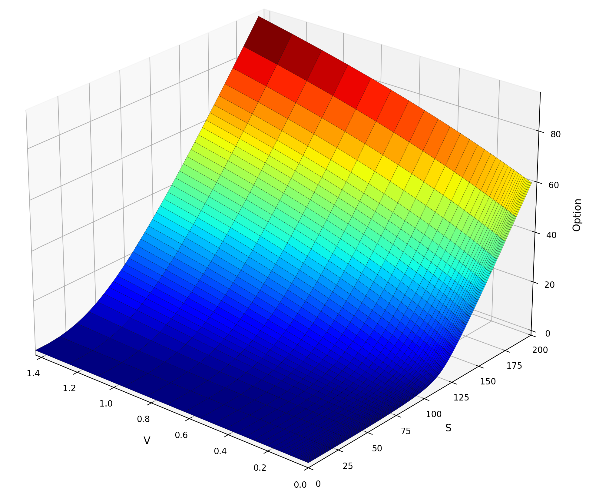
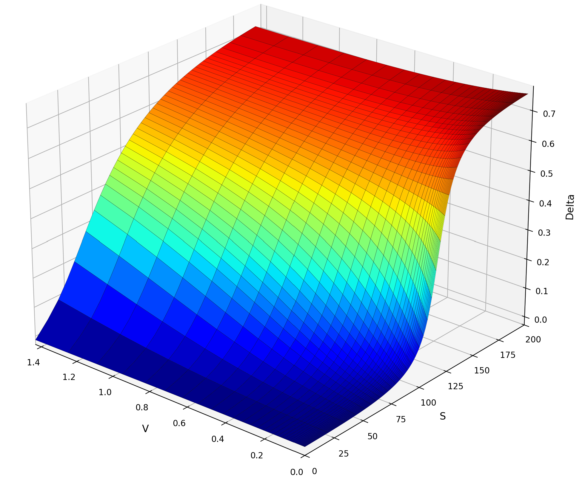
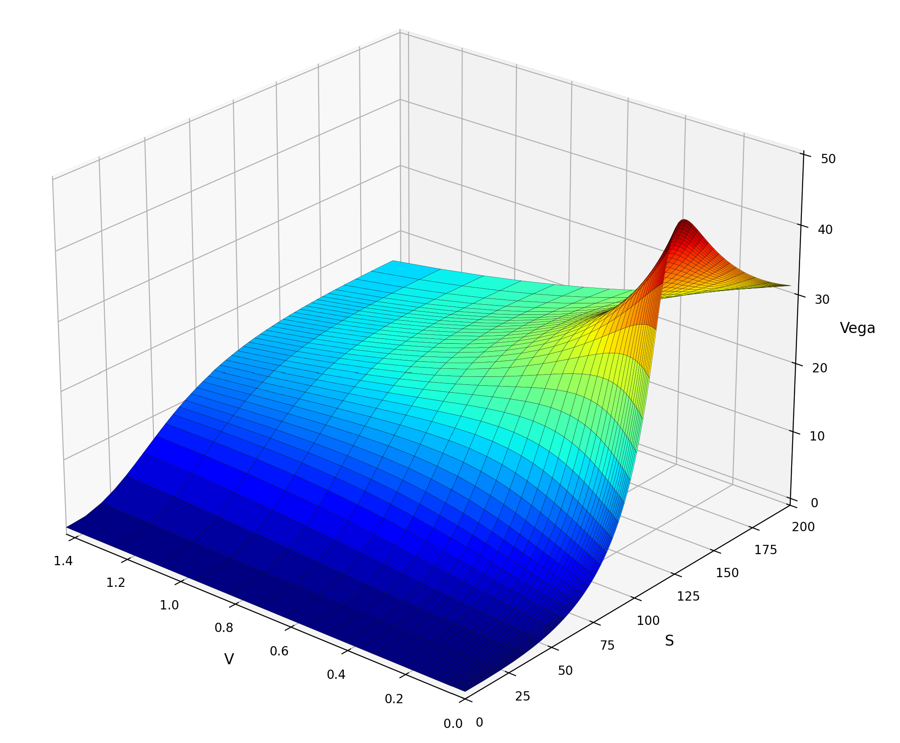
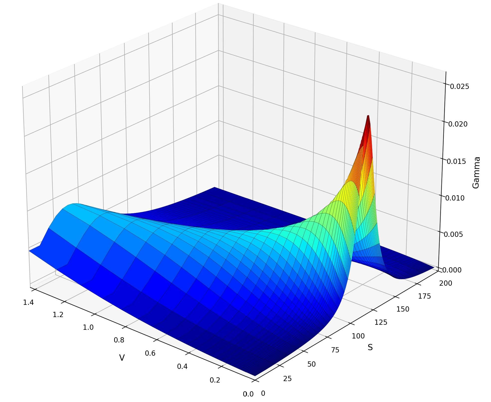

# Heston ADI — Option Pricing under Stochastic Volatility

Numerical solver for European call options under the **Heston stochastic volatility model**, using the **Modified Craig–Sneyd (MCS) Alternating Direction Implicit (ADI)** scheme.

The mathematical background is documented in [`Heston_ADI.pdf`](./Heston_ADI.pdf).

---

## Overview

The Heston model drives the asset price $S_t$ and variance $V_t$ jointly:

$$
\begin{aligned}
dS_t & = (r_d - r_f)\,S_t\,dt + \sqrt{V_t}\,S_t\,dW^1_t, \\
dV_t & = \kappa(\eta - V_t)\,dt + \sigma\sqrt{V_t}\,dW^2_t, \\
d\langle W^1, W^2\rangle_t & = \rho\,dt
\end{aligned}
$$

By the Feynman–Kac formula, the fair price $u(t,s,v)$ satisfies a 2D parabolic PDE on $[0,T]\times[0,S_\mathrm{max}]\times[0,V_\mathrm{max}]$:

$$
\begin{aligned}
\partial_t u & = - r_d u + \alpha \cdot \nabla_x u + \frac{1}{2} \beta : \nabla_x^2 u , \\
u(0, s, v)   & = \phi (s) ,
\end{aligned}
$$

where the initial condition is $\phi (s) = \max(s-K,0)$ and

$$
	\alpha (t, s, v) =
	\begin{bmatrix}
		(r_d-r_f)s \\
		\kappa (\eta-v)
	\end{bmatrix} 
	\quad \text{and} \quad
	\beta (t, s, v)  =
	\begin{bmatrix}
		vs^2            & \rho \sigma v s \\
		\rho \sigma v s & \sigma^2 v
	\end{bmatrix} .
$$


This PDE is solved numerically by:

1. **Non-uniform mesh generation** — hyperbolic-sine grids concentrated near the strike $K$ (in $s$) and near $v = 0$.
2. **Finite-difference semi-discretisation** — second-order schemes on non-uniform grids, with a unified treatment of all boundary points.
3. **MCS ADI time-stepping** — second-order, unconditionally stable splitting scheme with $\theta = \tfrac{1}{3}$.

### Key design choice

Rather than imposing Dirichlet conditions $u(t,0,v)=0$ and $u(t,s,V_\mathrm{max})=se^{-r_f t}$ directly (which conflict with the payoff at $t=0$), the solver enforces their **time-derivative equivalents**:

$$\partial_t u(t,0,v) = 0, \qquad \partial_t u(t,s,V_\mathrm{max}) = -r_f\,s\,e^{-r_f t}$$

This avoids compatibility issues at $t=0$ and allows every grid point — boundary or interior — to be treated uniformly as an unknown.

---

## Results

Option price and Greeks for the default parameters:

<p align="center">
  
&nbsp; &nbsp; &nbsp; &nbsp;
  
</p>
<p align="center">
  
&nbsp; &nbsp; &nbsp; &nbsp;
  
</p>

---

## Project structure

```
src/
├── config.py                # Model and grid parameters (dataclass)
├── mesh_gen.py              # Non-uniform s- and v-grids (Section 2)
├── pde_coeff.py             # Heston PDE coefficients α₀, α₁, α₂, β₁₁, β₁₂, β₂₂
├── coeff_matrices.py        # Coefficient matrices Ω⁰, Ω¹, Ω², Ω¹¹, Ω²², Ω¹² on the grid
├── derivative_matrices.py   # Finite-difference matrices Ds, Dv, Dss, Dvv (Section 3)
├── boundary_condition.py    # Boundary modifications to Ω and D matrices (Sections 5.1–5.2)
├── forcing_factor.py        # Forcing corrections G¹, E¹, E¹¹ (Sections 5.1–5.2)
├── split_matrices.py        # ADI splitting A = A₀ + A₁ + A₂, g = g₀ + g₁ + g₂ (Section 5.4)
├── heston_adi.py            # MCS time-marching solver (Section 6)
├── greeks.py                # Delta, Gamma, Vega from the solution
├── visualize.py             # 3D surface plots of price and Greeks
└── main.py                  # Entry point
```

---

## Getting started

### Prerequisites

Python 3.10+ is recommended.

```bash
pip install numpy scipy matplotlib
```

### Running

```bash
cd src
python main.py
```

This runs the solver with the default parameters (see below) and displays four 3D surface plots: option price, Delta, Gamma, and Vega, over the region $S \in [0, 2K]$, $V \in [0, 1.5]$.

### Configuration

All parameters are set in `main.py` via the `Config` dataclass:

| Parameter | Default | Description |
|-----------|---------|-------------|
| `kappa`   | 0.38    | Mean-reversion rate κ |
| `eta`     | 0.09    | Long-run variance η |
| `sigma`   | 1.26    | Volatility of variance σ |
| `rho`     | −0.55   | Correlation ρ ∈ [−1, 1] |
| `r_d`     | 0.01    | Domestic interest rate |
| `r_f`     | 0.06    | Foreign interest rate |
| `K`       | 100.0   | Strike price |
| `T`       | 4.0     | Maturity |
| `m_1`     | 100     | Grid points in s-direction |
| `m_2`     | 50      | Grid points in v-direction |
| `N`       | 50      | Number of time steps |
| `theta`   | 1/3     | MCS implicitness parameter |

---

## Numerical method summary

### Spatial discretisation

- **s-grid**: piecewise hyperbolic-sine transformation, uniform near $[S_\text{left}, S_\text{right}]$ and stretched outside; heuristically $c = K/10$.
- **v-grid**: hyperbolic-sine transformation dense near $v=0$; heuristically $d = V_\mathrm{max}/500$.
- **Finite differences**: 3-point central differences for interior rows; one-sided (forward/backward) at boundaries. Backward differences used for $\partial_v u$ when $v_j \geq 1$.
- **Ghost-point elimination**: at $s = S_\mathrm{max}$, the Neumann condition $\partial_s u = e^{-r_f t}$ is used to eliminate the fictitious point $s_{m_1+1}$ from the $\partial^2_{ss}$ stencil.
- **Initial condition**: cell-average of the payoff $\varphi(s) = (s-K)^+$ at the grid point nearest to $K$, to reduce the kink error.

### Time discretisation — MCS scheme

The semi-discrete ODE $U' = (A_0 + A_1 + A_2)U + (g_0 + g_1 + g_2)$ is advanced by the 7-stage Modified Craig–Sneyd scheme per time step:

$$
\begin{aligned}
Y_0             & = U_{n-1} + \Delta t F(t_{n-1}, U_{n-1}) ,   \\
Y_j             & = Y_{j-1} + \theta \Delta t [ F_j(t_n, Y_j) - F_j(t_{n-1}, U_{n-1}) ] \text{for} j=1,2 ,  \\
\widehat{Y}_0   & = Y_0 + \theta \Delta t [ F_0(t_n, Y_2) - F_0(t_{n-1}, U_{n-1}) ] ,  \\
\widetilde{Y}_0 & = \widehat{Y}_0 + \Big ( \frac{1}{2} - \theta \Big ) \Delta t [ F(t_n, Y_2) - F(t_{n-1}, U_{n-1}) ] ,  \\
\widetilde{Y}_j & = \widetilde{Y}_{j-1} + \theta \Delta t [ F_j(t_n, \widetilde{Y}_j) - F_j(t_{n-1}, U_{n-1})] \text{for} j=1,2 ,  \\
U_n             & =\widetilde{Y}_2 ,
\end{aligned}
$$

The splitting assigns $A_0$ to the mixed derivative $\partial^2_{sv}$, $A_1$ to $s$-direction terms, and $A_2$ to $v$-direction terms. The two implicit systems $(I - \theta\Delta t A_1)$ and $(I - \theta\Delta t A_2)$ are LU-factored once and reused every step.


---

## References

- Heston, S. L. (1993). *A Closed-Form Solution for Options with Stochastic Volatility*. Review of Financial Studies, 6(2), 327–343.
- in 't Hout, K. J., & Foulon, S. (2010). *ADI finite difference schemes for option pricing in the Heston model with correlation*. International Journal of Numerical Analysis & Modeling, 7(2).
- Ekström, E., & Tysk, J. (2010). *The Black–Scholes equation in stochastic volatility models*. Journal of Mathematical Analysis and Applications, 368(2), 498–507.
